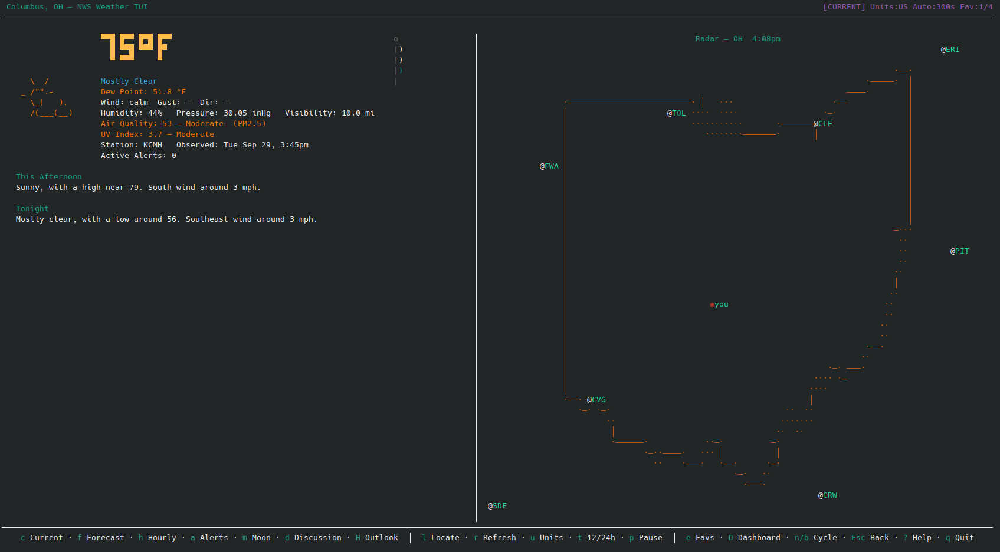
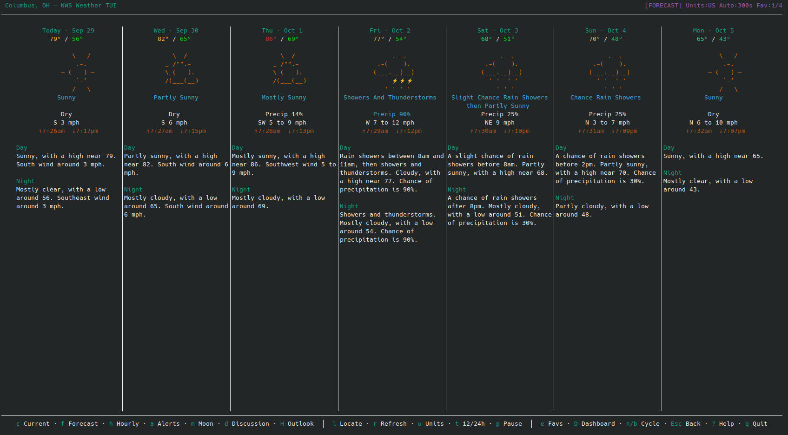
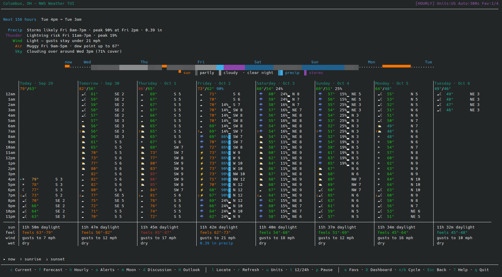
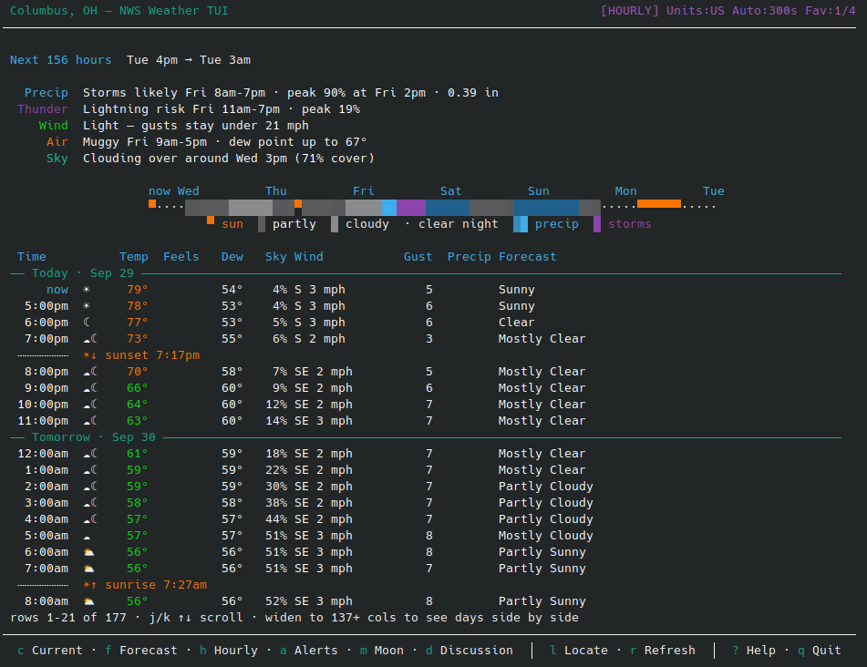
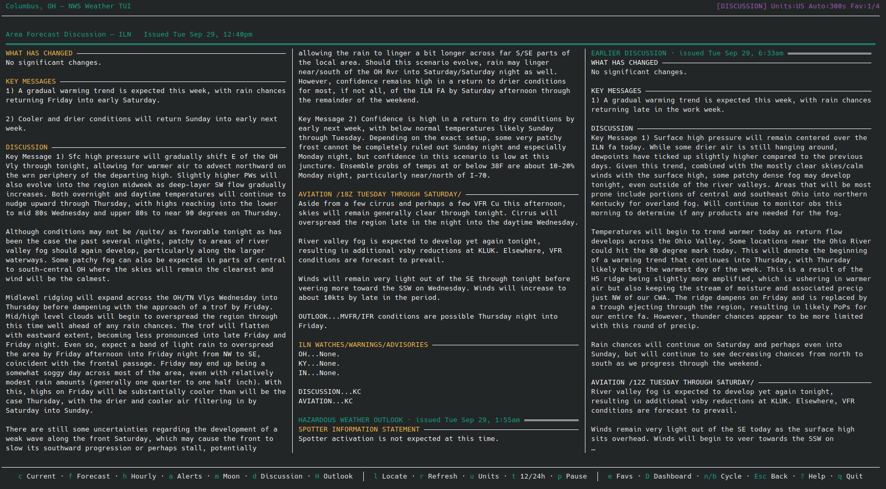
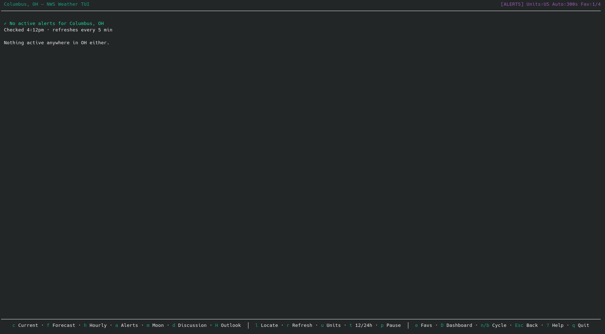
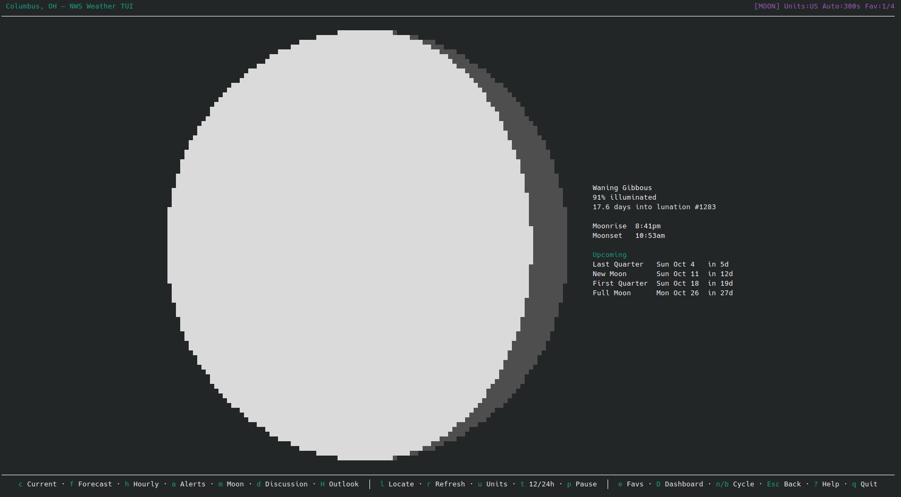
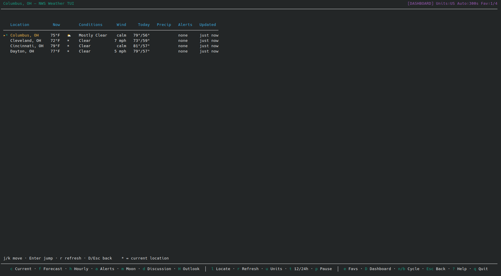

# NWS Weather TUI

A terminal weather app for the US, powered by the [National Weather Service API](https://www.weather.gov/documentation/services-web-api). Built with Python and curses. Every view adapts to the size of your terminal, from an 80-column window up to an ultrawide one.




*Screenshots show Columbus, Ohio.*

## Features

### Current conditions (`c`)
- Temperature in large block digits, colored by how warm it is, plus conditions, dew point, wind, gusts, humidity, pressure and visibility from the nearest NWS station
- Heat index or wind chill when it differs meaningfully from the air temperature
- Air quality and UV index
- An animated windsock that droops, fills and flutters with the wind speed
- A radar panel. On wide terminals it sits beside the conditions at full height, the map widens east and west to fill the space, and the NWS forecast for today and tonight fills the column under the conditions

### Radar
- 256-color half-block rendering (▀/▄) on the NWS dBZ color scale, with an ASCII fallback for terminals without 256 colors
- Animation: `A` plays recent frames, `<` / `>` step through them
- State borders, city labels, and polygons for active warnings drawn in red
- `◉ you` marks your location; click a city label to jump there
- Three sources, tried in order: NOAA MRMS composite, Iowa State IEM NEXRAD, the NWS station WMS
- `o` opens weather.gov radar in your browser

### Forecast (`f`)



- A column per day, with all seven days side by side from about 120 columns wide (`←` / `→` scroll on narrower terminals)
- Each day shows the high and low (colored by temperature), the icon and summary, chance of precipitation, wind, and sunrise and sunset
- The NWS day and night forecast text fills the rest of each column

### Hourly (`h`)



- The full hourly forecast the NWS publishes, about 6½ days
- An "at a glance" list that calls out what's notable instead of charting the obvious daily temperature curve: when rain starts and stops and how much, lightning risk, gusts, feels-like divergence, temperature swings that run against the day/night cycle (fronts), humidity, and clearing or clouding over
- A condition ribbon covering the whole period, with a tick for each day
- On wide terminals, a column per day with hours running down the rows, sunrise/sunset markers, and a summary for each day (daylight, feels-like range, strongest gust, precipitation total)
- On narrower terminals, a scrolling table grouped by day with feels-like, dew point, sky cover, gust and precipitation columns



### Area Forecast Discussion (`d`)



- The latest forecaster narrative from your local NWS office, laid out in newspaper columns. The number of columns follows the terminal size while keeping lines a comfortable reading width
- The raw product is cleaned up: boilerplate and `&&`/`$$` markers removed, section headings styled, prose reflowed, and tables such as point temps/PoPs kept intact
- `j` / `k` turn the page. Room left on the last page is filled with the Hazardous Weather Outlook, then earlier discussions (dimmed)

### Hazardous Weather Outlook (`H`)
- Your office's rolling 7-day outlook for hazardous weather, in the same column layout
- Offices issue one only when there's something to flag; when there isn't, the view says so

### Alerts (`a`)
- Active NWS alerts for your location, most severe first, with headline, timing, description and instructions
- When there are none, shows when that was last checked and lists anything active elsewhere in your state



### Moon phase (`m`)



- A round, shaded moon showing the current illumination, sized to the terminal
- Phase name, illumination, age and lunation number
- Moonrise and moonset (requires `astral`), and the dates of upcoming phases

### Favorites (`F`, `n`/`b`, `e`, `D`)



- Save the current location with `F`, and cycle through favorites with `n` / `b`
- An editor (`e`) to add, rename, delete and reorder favorites
- A dashboard (`D`) with current conditions, today's high/low, chance of precipitation and active alerts for every favorite, refreshed in the background

### Everything else
- Location search by city/state, ZIP code, or `lat,lon` (`l`)
- US or SI units (`u`), 12- or 24-hour clock (`t`)
- Auto-refresh every 5 minutes by default; pause with `p`
- A footer of key hints that fits whatever width it has, most important first
- Offline mode: falls back to the last saved data when the network is down
- Times are shown in your computer's time zone

## Installation

```bash
git clone https://github.com/crinderneck/nws-weather-tui.git
cd nws-weather-tui

pip install pillow requests

# Optional
pip install astral   # sunrise/sunset and moonrise/moonset times
pip install numpy    # faster radar decoding
```

## Usage

```bash
python -m nws_weather_tui
# or, from the repo root
python __main__.py
```

## Keyboard shortcuts

| Key | Action |
|-----|--------|
| `c` | Current conditions |
| `f` | Forecast |
| `h` | Hourly |
| `a` | Alerts |
| `m` | Moon phase |
| `d` | Area Forecast Discussion |
| `H` | Hazardous Weather Outlook |
| `D` | Favorites dashboard |
| `?` | Help |
| `l` | Search location |
| `r` | Refresh now |
| `u` | Toggle US / SI units |
| `t` | Toggle 12h / 24h clock |
| `p` | Pause / resume auto-refresh |
| `F` | Save / remove the current location as a favorite |
| `n` / `b` | Next / previous favorite |
| `e` | Favorites editor |
| `A` | Play / pause radar animation |
| `<` / `>` | Step radar frames |
| `o` | Open weather.gov radar in a browser |
| `j` / `k`, `↓` / `↑` | Scroll, or turn the page in the discussion |
| `←` / `→` | Scroll forecast days |
| `PgDn` / `PgUp` | Scroll by 10 lines |
| `G` | Jump to the end |
| `Esc` | Back to current conditions |
| `q` | Quit |

In the favorites editor: `j`/`k` move, `J`/`K` reorder, `Enter` jumps, `a` adds, `r` renames, `d` deletes, `e`/`Esc` exits. In the dashboard: `j`/`k` move, `Enter` jumps, `r` refreshes, `D`/`Esc` returns.

## Configuration

Settings live in `~/.config/nws-weather-tui/config.json`, which is created with defaults on first run and updated as you change location, units or favorites. The last fetched data is kept in `state.json` alongside it for offline use.

| Setting | Default | Description |
|---------|---------|-------------|
| `location_name`, `lat`, `lon` | built-in default | Current location; easiest to set with `l` |
| `units` | `"us"` | `"us"` or `"si"` |
| `use_24h` | `false` | 24-hour clock |
| `auto_refresh_seconds` | `300` | Auto-refresh interval |
| `http_timeout` | `10` | Seconds before an API request gives up |
| `hourly_hours` | `0` | Hours shown in the hourly view; `0` shows everything the NWS provides |
| `show_radar_map` | `true` | Show radar on the current conditions view |
| `favorites` | `[]` | Saved locations (`name`, `lat`, `lon`) |
| `radar.animation_frames` | `8` | Frames in the radar animation |
| `radar.animation_interval_s` | `0.5` | Seconds between animation frames |
| `radar.animation_step_min` | `5` | Minutes between animation frames |
| `radar.show_state_lines` | `true` | State border overlay |
| `radar.show_city_labels` | `true` | City labels on the radar |
| `radar.max_city_labels` | `20` | Most city labels drawn at once |
| `radar.show_alert_polygons` | `true` | Warning polygons on the radar |
| `radar.ascii_ramp` | `" .:-=+*#%@"` | Characters for the ASCII radar fallback |
| `cache_ttls` | per endpoint | Seconds to cache each kind of API response |

Set `WEATHER_APP_UA` to override the User-Agent sent to the NWS API.

## Code layout

| Module | Purpose |
|--------|---------|
| `app.py` | `App` class, main loop and drawing dispatch |
| `input_handler.py` | Key and mouse handling, prompts |
| `weather_refresh.py` | Background fetch of all weather data |
| `client.py` | NWS API client (delegates to the radar, geocoding, boundary, air quality and UV clients) |
| `models.py` | Data classes and API response extraction |
| `text_product.py` | Cleanup and reflow of NWS text products (AFD, HWO) |
| `views_*.py` | One module per screen, plus `views_chrome.py` for the header and footer |
| `radar_*.py`, `overlays.py` | Radar fetching, decoding, rendering and map overlays |
| `dashboard.py`, `favorites.py` | Favorites dashboard fetch and favorites editing |
| `moon.py`, `windsock.py`, `icons.py` | Moon math, windsock animation, weather icons |
| `constants.py`, `persistence.py` | Default config, config and state files |

## Requirements

- Python 3.8+
- A terminal with curses support (most Linux and macOS terminals)
- A 256-color terminal is recommended for radar; it falls back to ASCII automatically
- `pillow` and `requests`; optionally `astral` and `numpy`

## Data sources

Weather data comes from the [National Weather Service API](https://api.weather.gov), which is free, needs no API key, and covers the United States. Air quality and UV index come from the free [Open-Meteo API](https://open-meteo.com/) (no key needed) and never take the app offline if unavailable.
